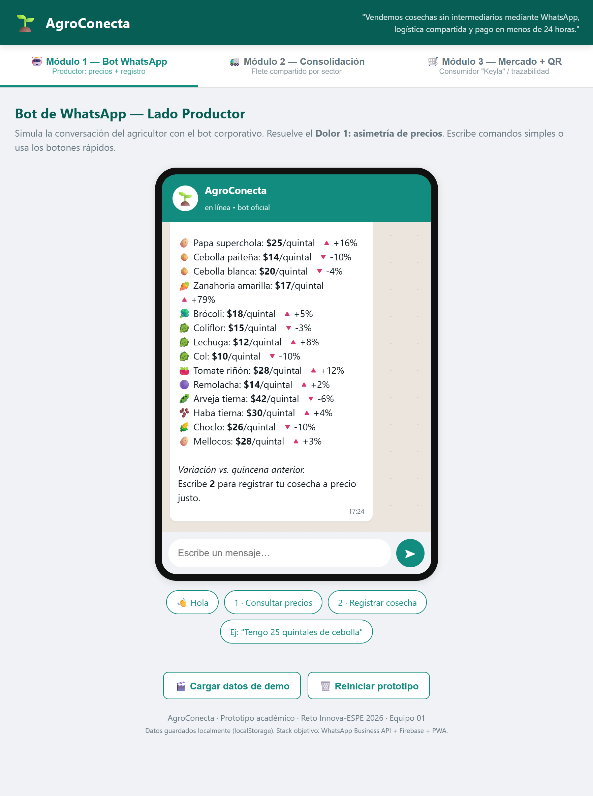
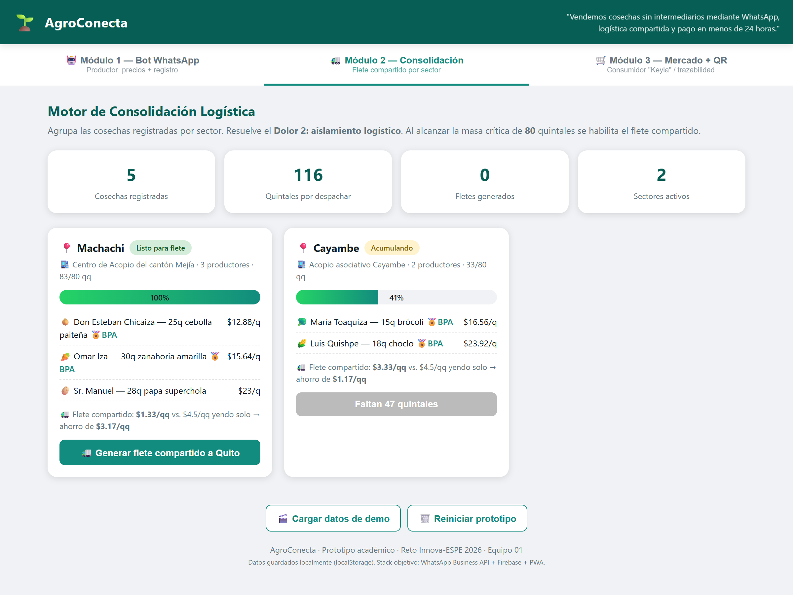
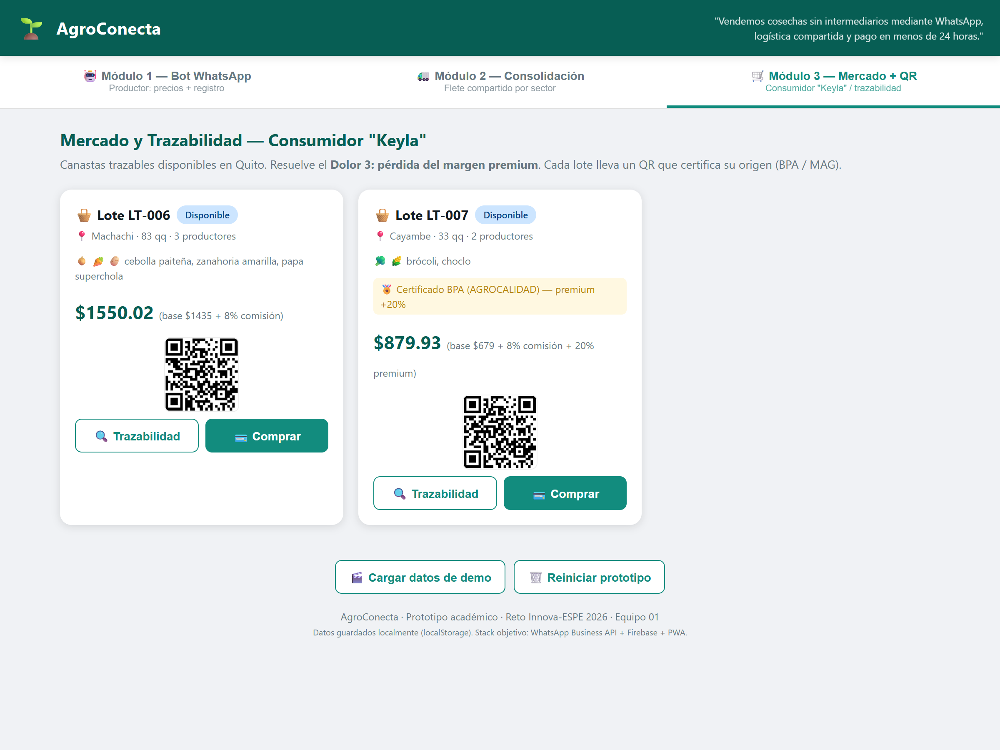
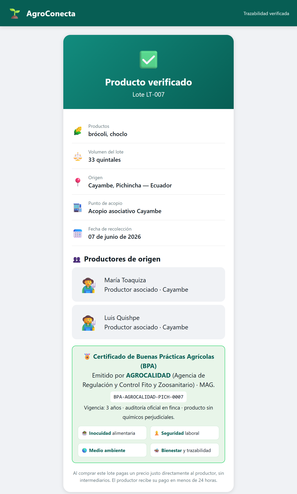

<div align="center">

# 🌱 AgroConecta — Prototipo funcional

**Comercialización agrícola directa, sin intermediarios, vía WhatsApp**

Reto Innova-ESPE 2026 · Carrera de Ingeniería de Software · Equipo 01

*"Vendemos cosechas sin intermediarios mediante WhatsApp, logística compartida y pago garantizado en menos de 24 horas."*

</div>

---

## 📌 ¿Qué es?

AgroConecta conecta a **pequeños productores de hortalizas** de la Sierra centro-norte de Pichincha
(Machachi, Cayambe, Tabacundo) con **consumidores urbanos de Quito**, eliminando al intermediario
que les quita hasta el **60 % del valor** de su cosecha.

El prototipo es una **app web funcional** (HTML/CSS/JS) que demuestra los **3 módulos** de la solución,
cada uno atacando uno de los tres dolores validados en las entrevistas de campo.

> 🔎 Los datos NO son genéricos: precios mayoristas reales (Mercado Mayorista de Quito / SIPA-MAG),
> productos reales de Machachi/Cayambe, certificación **BPA de AGROCALIDAD** y el **Centro de Acopio
> del cantón Mejía** como punto de consolidación.

---

## ▶️ Cómo ejecutarlo

No requiere instalación. Abre **`index.html`** en Chrome o Edge.

**Demo guiada en 30 segundos:**
1. Pulsa **🎬 Cargar datos de demo** (siembra 5 cosechas reales).
2. Ve al **Módulo 2** → el sector *Machachi* ya supera los 80 quintales → **Generar flete compartido**.
3. Ve al **Módulo 3** → aparece el lote con su **QR** → *Trazabilidad* / *Comprar*.

> 💡 Modo presentación por URL (sin clics):
> `index.html?seed=1&consolidar=Machachi&tab=mercado`

---

## 🧩 Los 3 módulos (uno por dolor, según la rúbrica)

### 1️⃣ Bot de WhatsApp — *Dolor 1: asimetría de precios*

Chat simulado donde el agricultor consulta **precios mayoristas reales del día** (con su variación %)
y registra su cosecha por comandos simples. Sin apps que descargar.

<div align="center">
  
</div>

---

### 2️⃣ Consolidación logística — *Dolor 2: aislamiento logístico*

Agrupa las cosechas por sector y su **centro de acopio**. Al alcanzar la masa crítica de **80 quintales**
habilita el **flete compartido a Quito**, mostrando el **ahorro real por quintal** frente a viajar solo.

<div align="center">
  
</div>

---

### 3️⃣ Mercado + Trazabilidad QR — *Dolor 3: pérdida del margen premium*

Publica las canastas para el consumidor urbano "Keyla" con precio (8 % comisión + premium BPA) y un
**código QR** por lote. Al escanearlo se abre el **certificado de origen**.

<div align="center">
  
</div>

El QR abre esta página de **trazabilidad** con el **certificado BPA real de AGROCALIDAD**
(4 pilares, vigencia 3 años) y los productores de origen:

<div align="center">
  
</div>

---

## 📁 Estructura

```
AgroConecta-Prototipo/
├── index.html          ← App principal (3 módulos en pestañas)
├── trazabilidad.html   ← Página que abre el QR (certificado de origen)
├── css/styles.css      ← Estilos (tema WhatsApp + agrícola)
├── js/
│   ├── db.js           ← Capa de datos (localStorage; preparada para Firebase)
│   └── app.js          ← Lógica del bot y de los 3 módulos
└── docs/img/           ← Capturas de este README
```

---

## 💰 Modelo de negocio

| Fuente de ingreso | Detalle |
|---|---|
| **Comisión (Take Rate)** | **8 %** por transacción, incluida en el precio final |
| **Margen premium** | **+15–25 %** por trazabilidad / certificación BPA |
| **Analítica agrícola** | Reportes de precios y volúmenes para asociaciones aliadas |

**Infraestructura del piloto: USD 0** → Firebase (plan Spark), WhatsApp Business (capa gratuita),
Glide/Bubble (PWA), alianza logística con Heifer Ecuador.

---

## 📊 Datos reales usados (fuentes)

- **Productos de Machachi/Cayambe** — GAD Pichincha / MAG.
- **Precios mayoristas** — Mercado Mayorista de Quito · [SIPA-MAG](https://sipa.agricultura.gob.ec/index.php/mercado-mayorista-quito).
- **Certificación BPA** — [AGROCALIDAD](https://www.agrocalidad.gob.ec/wp-content/uploads/2021/10/MANUAL-DE-FUNCIONAMIENTO-DEL-ESQUEMA-DE-CERTIFICACI%C3%93N-DE-BPA-BPP.pdf) (4 pilares, vigencia 3 años).
- **Centro de acopio** — [MAG: productores de Mejía impulsan centro de acopio](https://www.agricultura.gob.ec/productores-de-mejia-impulsan-la-creacion-de-un-centro-de-acopio-en-el-canton/).

---

## 🔌 Migración a Firebase (siguiente paso)

Toda la persistencia está aislada en `js/db.js`, marcada con comentarios `// FIREBASE`. Para producción:
- Reemplazar `_leer()` / `_guardar()` por **Firestore** (`getDocs`, `addDoc`, `setDoc`).
- Conectar el Módulo 1 con la **WhatsApp Business API** real.
- Integrar una **pasarela de pago** para el cobro en menos de 24 h.

---

## 📈 Métricas clave del piloto (objetivo)

| Métrica | Meta |
|---|---|
| Tiempo de registro de cosecha | < 90 segundos |
| Retención de productores | ≥ 60 % |
| Transacciones en el piloto | ≥ 20 |
| Incremento de ingreso por quintal | ≥ 20 % |
| Satisfacción (NPS) | ≥ 8/10 |

<div align="center">

**AgroConecta** · Prototipo académico · 2026

</div>
